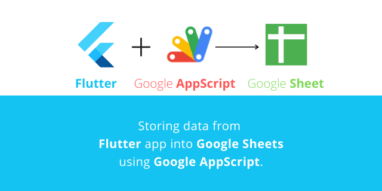
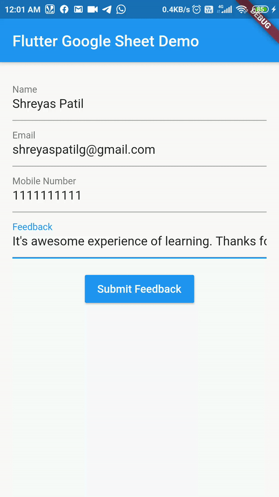
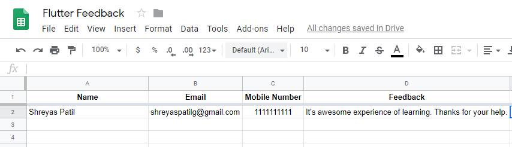

# [📱 Flutter 💙 to Google Sheets 📊](https://patilshreyas.github.io/Flutter2GoogleSheets-Demo/demo/)
A Demo application which stores User feedback from ***Flutter application*** into ***Google Sheets*** using ***Google AppScript***.

## You can try Web version of this app [here](https://patilshreyas.github.io/Flutter2GoogleSheets-Demo/demo/).

## 💡 Introduction
- [***Google Sheets***](https://docs.google.com/spreadsheets/) is a very powerful tool 🔥 if we look into deep in it. 
- It provides us interface using [***Google AppScript***](https://script.google.com/) so that we can do various types of operations on Google Spreadsheet. 
- We can perform all types of operations like Reading/Inserting/Updating/Deleting using AppScript on Google Sheets. It's so much powerful and capable that we can even use Google Sheets as a backend of our application 📲.
- Here we'll develop a sample flutter application, which simply takes user User Feedback, makes HTTP request to Google AppScript and AppScript then stores that feedback in Google Sheets.

This project is a starting point for a Flutter application.

A few resources to get you started if this is your first Flutter project:

- [Lab: Write your first Flutter app](https://flutter.dev/docs/get-started/codelab)
- [Cookbook: Useful Flutter samples](https://flutter.dev/docs/cookbook)

For help getting started with Flutter, view our
[online documentation](https://flutter.dev/docs), which offers tutorials,
samples, guidance on mobile development, and a full API reference.

### Show some :heart: and star the repo to support the project

   

## ⚡️ Project Files
- [**Flutter Application**](lib/) - Flutter Application Code.
- [**AppScript Code**](code.gs) - Google AppScript code to deploy as Web app for interface between Flutter app and Google sheet.

## What's Happening? 🤔
In flutter, when button is pressed, `HTTP` `GET` request is called on AppScript `URL` which retireves parameter from request and then appends row data in Google Sheets. Thus, data from flutter in inserted into Google Sheets.

## ⚡️ Results
You can run this app on web [here](https://patilshreyas.github.io/Flutter2GoogleSheets-Demo/demo/)

  
  

As you can see, In first image, When *Submit Feedback* button is Clicked then that feedback is stored in *Google Sheet* as in Second image.
Hurrah!😍 thus we have successfully implemented Google Sheets with Flutter.

### :heart: Found this project useful?
If you found this project useful, then please consider giving it a :star: on Github and sharing it with your friends via social media.
> Sharing is Caring!

## Connect With Me
If you want to contact me, feel free to reach me…
Visit [My Profile](https://patilshreyas.github.io).
